# GitHub Classrooms Introduction
Prof. Pete Benbow

- [Introduction](#introduction)
- [Configure GitHub in RStudio](#configure-github-in-rstudio)
  - [Set your user name and email](#set-your-user-name-and-email)
  - [Create a GitHub token](#create-a-github-token)
  - [Set cache timeout](#set-cache-timeout)
  - [Add your token to RStudio](#add-your-token-to-rstudio)
- [Clone the repository](#clone-the-repository)
  - [Copy the repo URL](#copy-the-repo-url)
  - [Create a new project in RStudio](#create-a-new-project-in-rstudio)
  - [Verify project creation](#verify-project-creation)
- [Creating Quarto files](#creating-quarto-files)
  - [Create the file](#create-the-file)
  - [Add your setup block](#add-your-setup-block)
  - [Add section headings](#add-section-headings)
  - [Add a code block and figure](#add-a-code-block-and-figure)
  - [Render](#render)
- [Customize your webpage](#customize-your-webpage)
  - [Add a table of contents](#add-a-table-of-contents)
  - [Set a theme](#set-a-theme)
- [Add other types of content](#add-other-types-of-content)
- [Reflect](#reflect)
- [Submitting to GitHub Classrooms](#submitting-to-github-classrooms)
  - [The Git panel in RStudio](#the-git-panel-in-rstudio)
  - [Workflow for submitting changes](#workflow-for-submitting-changes)
  - [Stage your changes](#stage-your-changes)
  - [Commit your changes](#commit-your-changes)
  - [Push your changes](#push-your-changes)
- [Submitting to Gradescope](#submitting-to-gradescope)
- [Next steps](#next-steps)

# Introduction

This homework will introduce you to **GitHub Classrooms** (GHC), which
will be our platform for the final project for this course. To
familiarize yourself with the GitHub workflow, you will complete a
demonstration assignment that I have staged in GHC for you.

We’re using GHC for a few reasons:

- GitHub is one of the preeminent platforms for data scientists and
  software engineers to manage and share code. If you continue down this
  path as a career or even as a hobby, you will undoubtedly use GitHub
  at some point.
- GitHub allows you and your partner to work on the project in parallel,
  each of you contributing code separately without needing to be on the
  same computer or even in the same physical space.
- GHC works better for long projects that take several weeks, and that
  have intermediate deliverables like your project proposal and EDA.
- GitHub integrates with Gradescope, allowing you to seamlessly submit
  assignments from one platform directly to the other.

Hopefully this assignment gets you oriented to the platform and ready to
start your final project!

# Configure GitHub in RStudio

First, we should begin by making sure your RStudio environment in
JupyterHub is correctly configured to work with GitHub Classrooms.

This part of the homework will require you to run several commands in
the **RStudio console**.

## Set your user name and email

    usethis::use_git_config(user.name = "John Smith", user.email = "josmith@davidson.edu")

## Create a GitHub token

    usethis::create_github_token()

This command should open a new browser tab and take you back to GitHub.
Specifically, it should take you to a screen where you are prompted to
create a new PAT (personal access token), which will allow RStudio to
communicate with your GitHub repository.

Give the token a description, like “CSC110 RStudio token,” then set the
expiration date for at least 90 days from today’s date. All other
settings can stay the same. Finally, click the “Generate Token” button
at the bottom of the page.

> [!IMPORTANT]
>
> - Save your token
> - *Save your token*
> - **SAVE YOUR TOKEN**
>
> When GitHub displays your token, **make sure you save it somewhere!**
> I cannot believe how many of my students in previous semesters failed
> to do this, even when I gave them explicit instructions to do so!
>
> The best place to save it is in a reputable password manager like
> 1Password, but at least make sure you put it in a Google Doc somewhere
> so you don’t lose it. Otherwise you will need to repeat this process.
> **DO NOT SAVE YOUR TOKEN INSIDE RSTUDIO!**

## Set cache timeout

    usethis::use_git_config(credential.helper="cache --timeout=7800000")

This command should ensure that your GitHub token stays cached in
RStudio for the required number of days (7.8 million seconds = roughly
90 days).

## Add your token to RStudio

Use the token you generated two steps ago to run the following command.
Simply copy-paste your token into the section that starts with “ghp\_”.

    credentials::set_github_pat("ghp_tokenblahblahblah")

This stores your token in RStudio, and should finish the GitHub config
process.

# Clone the repository

With the config steps completed, we can bring the assignment from GitHub
into RStudio very easily!

The Git VCS (version control system), which is what GitHub is built on,
comes with its own lexicon that can seem really opaque and confusing.
Pulling, committing, pushing, cloning, forking… these are all parts of
the GitHub workflow that you will learn over the coming weeks.

We’ve already encountered one term, **repository** (or “repo” for
short), which is the fundamental unit of organization in GitHub. A repo
is a collection of files for a specific project or purpose, like a
website or a research paper.

When we **clone** a repo, we are creating a working copy of it on our
workstation. Normally this would be your laptop, but in this case we
will create a working copy of the repo on your JupyterHub instance. In
other words, by cloning the repo, you’re copying the assignment from
where it is hosted in GitHub and putting that copy in JupyterHub where
you can work on it inside RStudio.

Cloning the GHC demo repo is easy, but there are several steps, so
follow these carefully:

## Copy the repo URL

In the GHC Demo repo on GitHub, locate the green “Code” button located
near the upper-right corner above the list of files. Click to open the
Code menu, choose the HTTPS option, and copy the URL for your repo from
the menu to your clipboard.

The full URL should appear something like this:
`https://github.com/dav-dat110/ghc-demo-USERNAME.git`

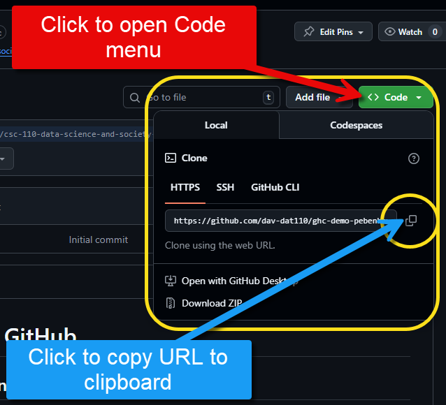

## Create a new project in RStudio

Next, open RStudio in JupyterHub and save all your open files. Then, go
to the File menu and select “New Project…”

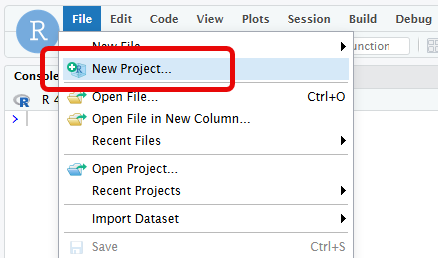

When the New Project window opens, select the option labeled “Version
Control.”

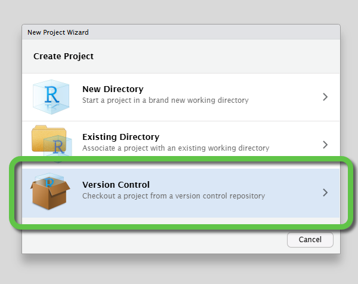

On the next screen, select the option labeled “Git.”

On the next screen, paste your repo’s URL into the box that asks for it,
then choose the directory that will host your assignment. Finally, click
the “Create Project” button. **I highly recommend that you host your
assignment within the “CSC110” directory, and NOT within the
“dat110_202501” subdirectory.**

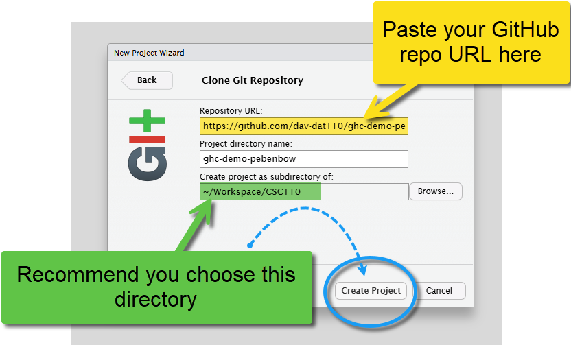

## Verify project creation

At this point, RStudio should reload and take you into your
newly-created project. You can tell that you’re inside the project by
looking at the small menu directly below your username in the
upper-right corner of RStudio. For this demo assignment, it should say
something like `ghc-demo-[USERNAME]`.

You should also see your project directory created in the Files window,
and if you click into it, you should see a Markdown file named “README.”
This file contains all the content you saw when you first accessed your
repo in GitHub.

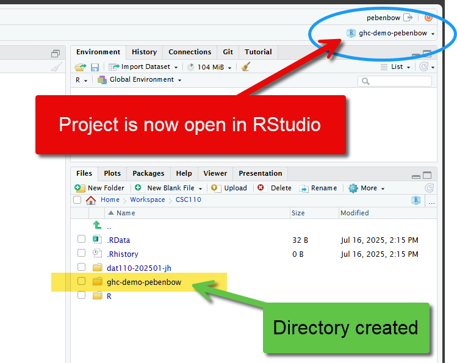

# Creating Quarto files

With the GitHub configuration complete and the project cloned into
RStudio, you should be ready to start the main part of the assignment by
adding content to your repo.

## Create the file

In the Files window, navigate to your project directory and add a new
Quarto file named `my-ghc-demo.qmd`.

At the top of your new Quarto document, add a YAML header and set the
properties for title (“GHC Demo Assignment”), subtitle (“CSC 110 - Data
Science & Society”), author, and date.

Finally, I want you to set up two (2) output formats for this document:

- The `pdf` format will be used to upload your final document to
  Gradescope.
- The `html` format will be used to explore how webpages render in
  Quarto.

> [!TIP]
>
> Working with multiple formats in Quarto docs can be tricky.
> <a href="https://quarto.org/docs/output-formats/html-multi-format.html"
> target="_blank">Read here</a> to see how it’s done!

## Add your setup block

Below your YAML header, add a setup block and load the tidyverse
package. At the top of the code block, set the `include` property to
`false`, then run the code block to load the tidyverse.

> [!TIP]
>
> If you want help with understanding the `include` option, and any
> other execution options you can use at the tops of code blocks,
> consult <a
> href="https://quarto.org/docs/computations/execution-options.html#output-options"
> target="_blank">this documentation</a>.

## Add section headings

Below your setup block, add a new section heading named “Homework”

Below the Homework section, add a second section named “Reflection”

> [!TIP]
>
> If you need a Markdown refresher, consult
> <a href="https://quarto.org/docs/authoring/markdown-basics.html"
> target="_blank">this documentation</a>.

## Add a code block and figure

Under the Homework section you just created, add a new R code block.
Inside the code block, use the `mpg` dataset that is bundled with the
tidyverse to create a scatterplot showing the impact of vehicle engine
size (displacement) on highway fuel mileage. Add appropriate data labels
for the title and axes.

In Quarto terminology, this will create a **figure**. Within Quarto, we
can manipulate figures in a lot of ways, such as by resizing them,
organizing them into grids, or assigning labels and captions to them.

At the top of the code block, use “chunk options” to set the figure
caption to “Fuel mileage scatterplot.”

> [!TIP]
>
> <a href="https://quarto.org/docs/authoring/figures.html#computations"
> target="_blank">This documentation</a> details how to add figure
> captions.

## Render

This is a good point at which to pause and render your Quarto file. If
you wrote your YAML correctly earlier, your Render button should be a
dropdown menu with options for both HTML and PDF formats. Render the
document once for each of the two formats. This should have the result
of adding a few files to your folder in RStudio. Your HTML output will
look fairly basic at first, but the next part of the assignment will let
you experiment with a few different ways to enhance the appearance of
your webpage.

------------------------------------------------------------------------

# Customize your webpage

## Add a table of contents

You don’t have a lot of content in this assignment, but your final
project will be much larger, and should be well-organized so content is
easier to locate. That’s the beauty of using section headings in
Markdown: they help us organize everything, and Quarto gives us the
ability to easily add a table of contents (TOC) to our webpage.

Consult [this
documentation](https://quarto.org/docs/reference/formats/html.html#table-of-contents),
then add a TOC to your Quarto file. Re-render your webpage to see the
changes. Experiment with the `toc-depth` and `toc-location` options to
see how they can be used to manipulate the appearance of your TOC.

## Set a theme

So far, your webpage has been pretty plain: black text on a white
background. However, Quarto makes it easy to enhance the look of your
HTML content by simply adding a theme in the YAML header.

To see how this works, browse the
<a href="https://quarto.org/docs/output-formats/html-themes.html"
target="_blank">list of available themes</a> for a theme that you like,
add it to your YAML header, then re-render your webpage.

> [!TIP]
>
> - If you want to get fancy with your theming, the documentation above
>   also shows you how to give your audience the ability to choose
>   between using a light theme or a dark theme, or how to use custom
>   themes!
>
> - When we start to build out your full website nearer to the end of
>   the final project, you’ll be able to see the effects of these
>   theming choices much more clearly, like when we start adding page
>   navigation, buttons, etc.

# Add other types of content

For the last part of this assignment, I want you to experiment with
adding several other things to your Homework so you can find out (A) how
to write them in Markdown, and (B) how they render in HTML.

Use <a href="https://quarto.org/docs/authoring/markdown-basics.html"
target="_blank">this documentation</a> to add each of the following
items below the code block you created earlier:

- A link to `davidson.edu`
- An unordered list displaying the other classes you are taking this
  semester
- An ordered list displaying your top 3 favorite movies or TV shows
- A footnote
- An equation showing the quadratic formula[^1] in **display mode**
- A flowchart diagram in Mermaid
- A page break between your Homework and Reflection headings
- A blockquote containing the first sentence of U.S. President Abraham
  Lincoln’s “Gettysburg Address”
- Three callout blocks, with one each of type `note`, `tip`, and
  `important`. Make one of the callout blocks collapsible.[^2]

# Reflect

Now that I’ve forced you to go through a veritable scavenger hunt of
different techniques you can use when authoring a webpage in Quarto, I
want you to pick three (3) tips, tricks, or techniques you just learned,
and write a paragraph about each one in which you contemplate how you
might use this to your advantage on your final project. That means you
should end up with three paragraphs overall.

Within each paragraph, experiment with using <a
href="https://quarto.org/docs/authoring/markdown-basics.html#text-formatting"
target="_blank">Markdown text formatting</a> to highlight certain text
by either making it **bold** or inserting `verbatim code`.

# Submitting to GitHub Classrooms

At this point. after you’ve met the requirements on the previous pages
and you’re comfortable with the appearance of your webpage, I want you
to re-render everything to HTML one final time, and render to PDF as
well! Then proceed through the following steps to submit the assignment
in GHC.

## The Git panel in RStudio

Look in your RStudio **environment pane**, and you should see a tab with
the label “Git.” Selecting this tab will display a list of files in your
RStudio project that have been added, deleted, or modified since you
started working on this assignment.

You should see both `my-ghc-demo.qmd` (your source file),
`my-ghc-demo.pdf` (your PDF output), and `my-ghc-demo.html` (the webpage
produced by your Quarto rendering process). You should also see several
files listed under a subdirectory named `my-ghc-demo_files/`.

## Workflow for submitting changes

In the world of Git and GitHub, the core workflow when writing code is
built around a sequence of commands: stage, then commit, then push.

1.  When we **stage** a file that we have added or modified, we are
    adding it to an unseen index in the project. This index acts as a
    “staging area” that holds any and all files we want to commit.

2.  When we **commit**, we take one or more staged changes, bundle them
    together, add a timestamp, and add a randomly-generated unique
    identifier, like `874fae36a6e30bc3f7001dbe7789d411cea9ff95`. This
    commit ID is known as an SHA, Secure Hash Algorithm, which acts as a
    digital signature for your commit. In effect, committing your
    changes creates a log that says, “I changed files A, B, and C at
    this time on this date.” This log entry is known as a **commit**, so
    it operates as both a verb and a noun in the Git lexicon. Commits
    are the fundamental building block of the Git version control system
    because they allow us to see the entire history of changes made to a
    project.

3.  When we **push**, we take our commits and we move them from our
    local working directory to the remote repository that exists in
    GitHub. In other words, the push process is what allows us to submit
    your changes from JupyterHub to GitHub.

These three core commands are all accessible via the Git panel in
RStudio, and are covered in the next section.

## Stage your changes

In the Git panel of your RStudio application, select all the files that
you added or modified while completing this homework. You can use
shift-click to select them, or you can left-click on a single file and
use `Ctrl+A` or `Cmd+A` to select all files in the Git window.

Once all files are selected, click the “Commit” button at the top of the
Git panel, and a new window should appear.

> [!CAUTION]
>
> If a new window does NOT appear when you click the “Commit” button,
> you may need to disable the popup blocker in your web browser!

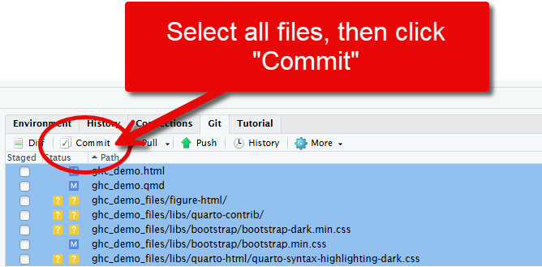

Once the new window appears, you can click the “Stage” button to stage
all the changed files. **Make sure you have selected the files before
you click the button!**

Staged files will appear in this list with a filled checkbox to the left
of their names. That is how you can differentiate staged changes from
unstaged changes.

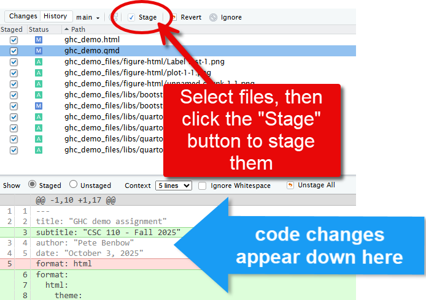

## Commit your changes

Next, after your changes are staged, you will bundle them into a commit.
To do so, add a “commit message” in the upper-right corner of the window
which describes the work you did.

Commits can be large or small. For example, you might have one massive
commit in which you did all the work for an assignment from start to
finish, and your commit message could just say, “Completed Homework 05.”

However, in the world of data science and software engineering, most
commits tend to be small chunks of work to do something very specific,
like fix a bug in the code or add a new feature. In those situations,
you might just modify a single file to implement those changes, and you
could commit that with a message like, “Fixed the bug that was causing
my bar chart to look weird,” or “Added a new scatterplot showing impact
of drivetrain on highway fuel mileage.”

There are a lot of different ways to do it, but for this homework you
can just do everything at once, like in my example.

When you’re done, click the “Commit” button to bundle your staged
changes into your first Git commit!

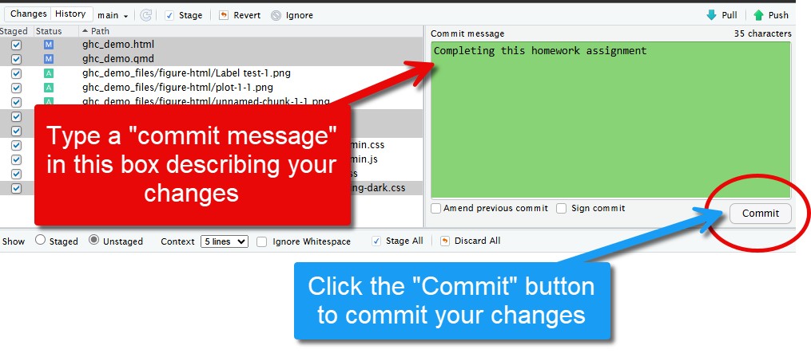

After the commit is created, your changes will disappear from the
left-hand part of the window, but a small message will show up at the
top informing you, “Your branch is ahead of ‘origin/main’ by 1 commit.”
This message means that your local working copy of the code (in
JupyterHub) is now different from the copy that is in GitHub. If you
navigate back to GitHub, you will notice the files there are unchanged.

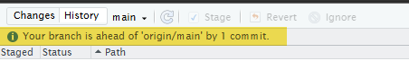

At its core, Git and GitHub track the **history** of files. When we
create commits like we just did, we are cataloging that history so we
can use it for comparison.

So when RStudio tells us that we are “1 commit ahead” of our code in
GitHub, that means the version of the code we have in RStudio has “more
history” than the version in GitHub. If we want to synchronize the
history, we need to **push** from RStudio to GitHub.

## Push your changes

The last step in our journey, and the last one you need to take to
finish this assignment, is to push your commits from your local repo
(JupyterHub) to the remote repo (GitHub).

Fortunately, this is super easy once you have committed your changes. In
the pop-up window that appeared earlier, and in the main Git panel in
RStudio, there is a “Push” button you can click which will push your
changes from JupyterHub to GitHub.

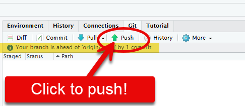

When you click the Push button, assuming that you followed all the
directions earlier in this assignment about setting up a token and
updating the cache timeout setting, you should get a very nondescript
message in a pop-up window that says something like
`874fae3..568675e HEAD -> main`.

I won’t bore you with the technical details here, but it basically means
the push worked! You have successfully sent your commits to GitHub. If
you open your GitHub repo in your browser now, you should see all the
changes you just made have been synchronized from JupyterHub!

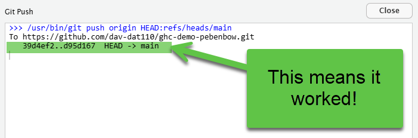

# Submitting to Gradescope

A new step I’m adding this semester is the integration between GitHub
and Gradescope. There will not be an autograder component to this, but
you can still submit your work directly from GitHub into our course page
in Gradescope so I can grade your work and provide feedback there.

To submit your assignment from GitHub to Gradescope:

1.  Login to Gradescope.
2.  Click on this assignment.
3.  When prompted to submit your assignment, first connect your GitHub
    account.
4.  Next, select the repository for your assignment.
5.  Next, select the branch that has the latest version of your work
    (should be “main”).
6.  Finally, click Upload!

> [!NOTE]
>
> Because there is no autograder configured for this assignment, I will
> be doing all grading manually. You will not receive any automated
> feedback.

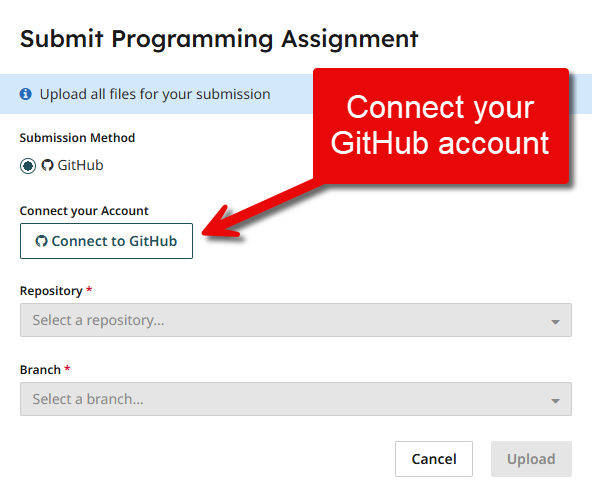

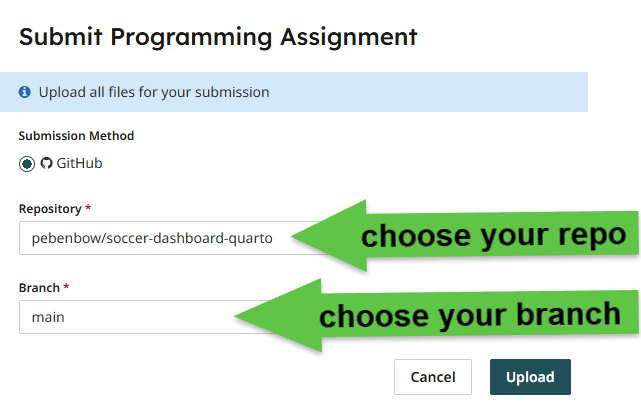

# Next steps

If you made it this far without issues, **congratulations!** Git and
other version control systems can be confusing to first-time users, and
it gets much more complicated when you have multiple people working from
the same repository! We won’t go down that rabbit hole just yet, but it
will be important to talk about as you start work on your final
projects.

After you have pushed your code up to GHC, download the PDF copy of your
homework assignment from RStudio and upload it to Gradescope.

For the final project, there will NOT be a Gradescope component. You
will simply submit your work via GHC from the time you begin working on
it until you push your final commit near the end of the semester!

**Last thing**: When you are done with this assignment in JupyterHub,
open the projects menu in the upper-right corner of RStudio and click
“Close Project.” If you don’t do this, the next time you open RStudio,
it will take you into this project instead of taking you to our normal
working directory where we do our other assignments.

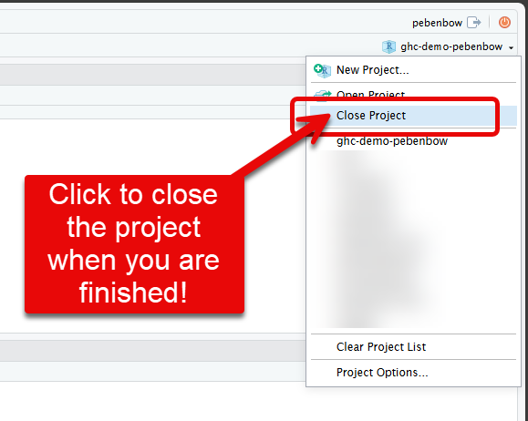

> [!IMPORTANT]
>
> You have reached the end of the homework!

[^1]: To get the formula to display correctly, use the following syntax
    inside of the `$$` delimiters that start and end the equation:
    `x = \frac{-b \pm \sqrt{b^2 - 4ac}}{2a}`

[^2]: In-depth documentation about callouts can be found
    <a href="https://quarto.org/docs/authoring/callouts.html"
    target="_blank">here</a>
